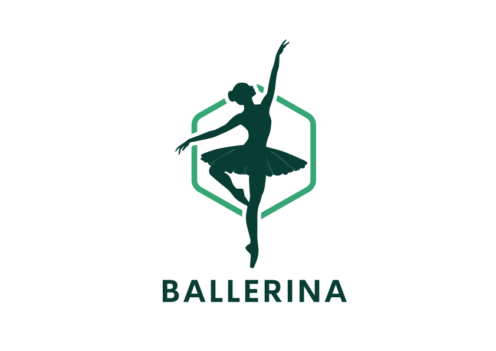

# Ballerina 🩰



A strongly-typed, expression-oriented language for building backend data models and business logic.
Programs describe **what** the data looks like and **how** it flows — the runtime handles storage, queries, and API generation.

---

## Hello World

```ballerina
let greeting = "Hello, World!"
in greeting
```

Run it:

```bash
ballerina -f hello.bl --run
```

---

## Basic types

```ballerina
let quantity    = 42            // int32
let price       = 19.99         // decimal  (exact — use for money)
let label       = "Widget"      // string
let created_at  = dateTime::utcNow()
let is_active   = true
```

---

## Records, unions, and functions

```ballerina
type ReviewResult =
| Rated      of int32
| MissingRating of string

type Book = {
  Title  : string;
  Author : string;
  Year   : int32;
}

// Curried function — partially apply it anywhere
let add = fun (x: int32) -> fun (y: int32) -> x + y

let normalize = fun (r: ReviewResult) ->
  match r with
  | Rated n        -> n
  | MissingRating _ -> 0
```

---

## Schemas — the core idea

A **schema** is a self-contained data model.
You declare entities, ID types, and the relations between them.
The runtime derives migrations, queries, and REST endpoints from it.

```ballerina
type AuthorId    = { AuthorId    : guid }
type BookId      = { BookId      : guid }
type PublisherId = { PublisherId : guid }

type AuthorRecord    = { AuthorName    : string }
type BookRecord      = { BookTitle     : string }
type PublisherRecord = { PublisherName : string }

type LibrarySchema =
  schema {
    entity Authors    { type AuthorRecord    AuthorId    }
    entity Books      { type BookRecord      BookId      }
    entity Publishers { type PublisherRecord PublisherId }

    relation AuthorBooks   { from Authors    to Books      cardinality 1..* }
    relation BookPublisher { from Books      to Publishers cardinality *..1 }
  }

let main = fun (schema: LibrarySchema) ->
  let author_id = { AuthorId = guid::v4() }
  let book_id   = { BookId   = guid::v4() }

  let author = { AuthorName = "Jane Austen"             }
  let book   = { BookTitle  = "Pride and Prejudice"     }

  do schema.Authors.insert    author_id author
  do schema.Books.insert      book_id   book
  do schema.AuthorBooks.link  author_id book_id
  in ()
```

---

## Schemas with permissions and hooks

```ballerina
type BlogSchema =
  schema {
    entity Posts { type Post PostId }

    on-create Posts (fun (post: Post) -> fun (db: BlogSchema) ->
      if String::length post.Title < 3 then
        error "Title too short"
      else post)

    can-read Posts (fun (db: BlogSchema) ->
      db.Posts.filter (fun (post: Post) -> post.IsPublic))
  }
```

---

## Sample programs

The [`samples/`](samples/) directory contains eight worked examples:

| # | Topic |
|---|-------|
| 01 | Hello world & primitive types |
| 02 | List manipulation |
| 03 | Records, unions, and sum types |
| 04 | Functions and type inference |
| 05 | Queries |
| 06 | Schemas and relations |
| 07 | Advanced schemas (permissions, joins) |
| 08 | Hooks and permission hooks |

Run any sample:

```bash
ballerina -f samples/01-hello-world-basic-types.blproj --run
```

---

## Install

### 1 — Install the runtime

```bash
cd ballerina
./install-runtime.sh
```

This publishes `ballerina.fsproj`, copies the self-contained binary to
`/usr/local/lib/ballerina/runtime/`, and creates a launcher at
`/usr/local/bin/ballerina`.

Override defaults with environment variables:

```bash
INSTALL_PREFIX=$HOME/.local ./install-runtime.sh
```

### 2 — Install the VS Code extension

The install script installs the extension automatically when the `code` CLI is
available.  To install manually:

1. Open VS Code.
2. Press **Cmd+Shift+P** (macOS) or **Ctrl+Shift+P** (Linux/Windows).
3. Run **Extensions: Install from VSIX…**
4. Select the `.vsix` file built from [`ballerina/vscode-bl-extension/`](ballerina/vscode-bl-extension/).

The extension provides syntax highlighting and inline type diagnostics for
`.bl` / `.blproj` files.

---

## CLI reference

```
ballerina --help

Options:
  -f, --file <path>     .bl or .blproj file to build (required)
  -r, --run             Execute the program after a successful build
  --debug-inlays        Print inlay type hints to the console

Commands:
  server                Persistent build server (stdin → JSON results)
```

### Prerequisites

- [.NET SDK 10.0.201](https://dotnet.microsoft.com/download) (pinned in `ballerina/global.json`)

### Credits

# Ballerina

With special thanks to BLP Digital, where Ballerina has been built:


